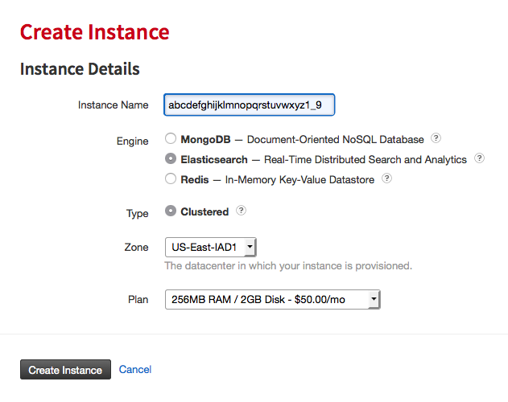
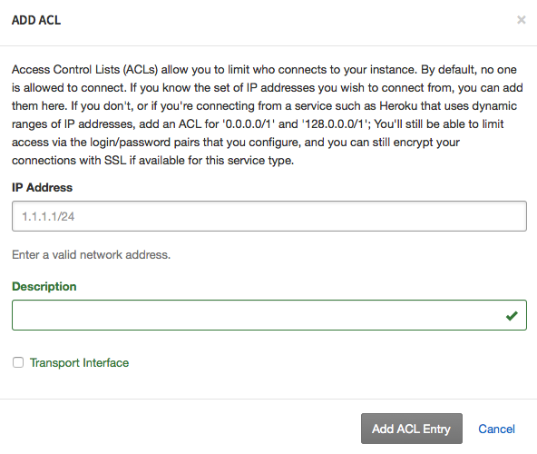
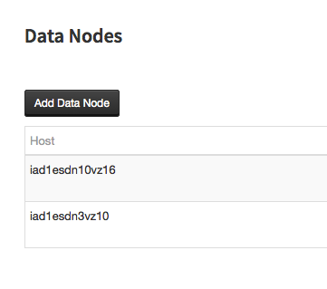

Elasticsearch FAQ
=================

What is Elasticsearch?
----------------------

Elastic.co defines Elasticsearch as a distributed, open source search and analytics engine, designed for horizontal scalability, reliability, and easy management. It combines the speed of search with the power of analytics via a sophisticated, developer-friendly query language covering structured, unstructured, and time-series data.

What does ObjectRocket Elasticsearch provide?
---------------------------------------------

Starting with many NoSQL data stores like Elasticsearch is easy, but daily administration, monitoring, backups, and scaling can add a heavy and challenging workload to already overtaxed teams. We take the operational burden off of your team with our purpose built platform and 24/7/365 Fanatical Support so you can focus on using Elasticsearch and not keeping it up and running.

How do I start?
---------------

If you have questions, we have data services specialists ready to assist, just contact us `here <http://objectrocket.com/contact>`_ or e-mail us at `sales@objectrocket.com <mailto:sales@objectrocket.com>`_!

If you are ready to sign up now and don’t already have an ObjectRocket account go to our `sign up <https://app.objectrocket.com/sign_up>`_ page to create one, or `log in <https://app.objectrocket.com>`_ to get started.

1. Create an instance
~~~~~~~~~~~~~~~~~~~~~

- Click the **Add Instance** button.

- Select a name for your instance. This can be almost anything, as any alpha numeric string is valid.

- Select a backend engine, Elasticsearch in this case.

- Select the default **Clustered** type.

- Select the default Elasticsearch zone, but we'll be launching in other zones soon!

- Select the best Memory and Storage size for your application.

- Click the **Create Instance** button.

You'll now be routed back to the **Instances** page, where you can see the build status of your instance. Yellow means it's in the build process, and green means it's ready to use. Click the name of your new instance to continue.

2. Add an Admin User
~~~~~~~~~~~~~~~~~~~~

- Under the **Users** heading, click the **Add User** button. Fill in the username and password, and for your first user make sure to create it as Admin.

.. image:: images/add_user_elastic.png
   :align: center

3. Add an ACL
~~~~~~~~~~~~~

- Under the heading **Security**, you have the option to **Add ACL**. This is necessary as we don't allow any access by default so you need to add any appropriate ACL's for your servers connecting to ObjectRocket. There are two fields: **IP Address** and **Description**. Only IP is mandatory, but a description can certainly help if you plan to have more than a few.

What else do I need to know?
----------------------------

How do I connect?
~~~~~~~~~~~~~~~~~

You can connect via Elasticsearch's RESTful API over HTTP/HTTPS or the transport client library for Java API access.

Is SSL supported?
~~~~~~~~~~~~~~~~~

Yes! By using the SSL connection string provided, we handle everything you need for SSL access using standard https:// links.

Can I setup multiple user types?
~~~~~~~~~~~~~~~~~~~~~~~~~~~~~~~~

Yes, we currently offer Admin, with full control, and read only users setup through the Control Panel.

Is there a free trial?
~~~~~~~~~~~~~~~~~~~~~~

Yes! Choosing the 256MB RAM / 2GB Disk instance will be free for the first 30 days.

What other sizes are available?
~~~~~~~~~~~~~~~~~~~~~~~~~~~~~~~

Check out our `plans and pricing <http://www.objectrocket.com/pricing>`_, and click the Elasticsearch tab!

What versions are supported?
~~~~~~~~~~~~~~~~~~~~~~~~~~~~

We currently default to **1.7.0**, but please contact `support@objectrocket.com <mailto:support@objectrocket.com>`_ if you need something different!

What kind of architecture is this using?
~~~~~~~~~~~~~~~~~~~~~~~~~~~~~~~~~~~~~~~~

When you build an ObjectRocket Elasticsearch instance, you get a cluster with a total of 9 nodes. We automatically configure 4 front-end client nodes, 3 master nodes, and 2 data nodes. This robust setup is ready to handle the load and scale of your most mission critical workloads.

What plugins are available by default?
~~~~~~~~~~~~~~~~~~~~~~~~~~~~~~~~~~~~~~

We install both `ElasticHQ <http://www.elastichq.org/>`_ and `elasticsearch-head <http://mobz.github.io/elasticsearch-head/>`_ by default in their default locations (``/_plugin/HQ and /_plugin/head``).

We can support other 3rd party plugins on a case by case basis.  Contact `support@objectrocket.com <mailto:support@objectrocket.com>`_ if you would like different plugins installed or if you would like us to disable them all.

What about backups?
~~~~~~~~~~~~~~~~~~~

We automatically backup your data every 24 hours using Elasticsearch snapshots.  Contact `support@objectrocket.com <mailto:support@objectrocket.com>`_ to request a restore.

What are the default number of shards and replicas per index?
~~~~~~~~~~~~~~~~~~~~~~~~~~~~~~~~~~~~~~~~~~~~~~~~~~~~~~~~~~~~~

ObjectRocket Elasticsearch instances are configured with the standard Elasticsearch default settings of ``number_of_shards = 5`` and ``number_of_replicas = 1``, which means any newly created index will have 5 primary shards, each with 1 replica shard (for a total of 10 shards for any new index). The number of primary shards can be specified per index when the index is created, as described in the `Create Index API <https://www.elastic.co/guide/en/elasticsearch/reference/current/indices-create-index.html>`_. If you would like to change these defaults for your ObjectRocket Elasticsearch instance, please contact `support@objectrocket.com <mailto:support@objectrocket.com>`_.

How can I add a data node?
~~~~~~~~~~~~~~~~~~~~~~~~~~

A new instance comes with two data nodes and more can be easily added after the initial instance creation. To add more nodes go to the Elasticsearch instance in the Control Panel and simply click the **Data Nodes** heading, then the  **Add Data Node** button and follow the prompts. Additional charges apply, so take a look at our `pricing <http://objectrocket.com/pricing>`_ page for details.

