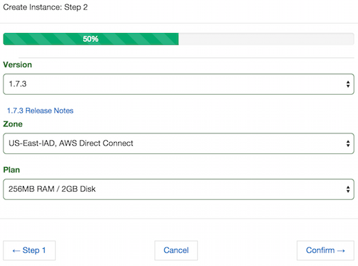
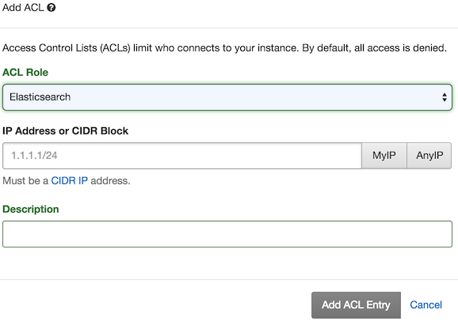

Getting Started with Elasticsearch
===================================

1. Create an instance
~~~~~~~~~~~~~~~~~~~~~

Step 1
------

#. Click the Instance heading, then click on *Add Instance*.

.. image:: images/addinstance.png
   :align: center

#. Enter a name for your instance. 

    This can be almost anything, as any alpha numeric string is valid.

#. Select Elasticsearch for the service.

.. image:: images/create_elastic.png
   :align: center

Click on *Step 2* to continue.

Step 2
------

#. Select a version to deploy.

    ObjectRocket offers Elasticsearch versions 1.7, 2.0, and 2.1

#. Select a zone.

    Zones are Rackspace and/or AWS Direct Connect zones, labeled by airport codes in that region. Check out the `zone map <http://objectrocket.com/features>`_ for more details.

#. Select a plan that suits your needs. 

    For more details, check out `plans and pricing <http://objectrocket.com/pricing>`_.

Click on *Confirm* to review your entries, then click *Create*. Your new instance is ready!

2. Add an Admin User
~~~~~~~~~~~~~~~~~~~~

#. Navigate to the *Users* section under the *Instances* heading.

#. Click *Add User*.

    Enter a username and password, and verify that the *admin* role is selected.

#. Click *Add User* again.

.. image:: images/add_user_elastic.png
   :align: center

.. _elastic_acl:

3. Add an Access Control List (ACL)
~~~~~~~~~~~~~~~~~~~~~~~~~~~~~~~~~~~

Access Control Lists (ACL) limit who connects to your instance. 

.. note::

    ObjectRocket denies access by default. Add an ACL for any server that connects to the instance.

#. In the Security section of the instance details page, click *Add ACL*.

#. Select an ACL role.

    - The default role, *Elasticsearch* allows access to the Elasticsearch REST API and any plugins.  

    - *Elasticsearch & Java API* allows access to the `Java API <https://www.elastic.co/guide/en/elasticsearch/guide/current/_talking_to_elasticsearch.html#_java_api/>`_ via the Transport Client library.

    - *Kibana* allows access to a `Kibana instance <https://www.elastic.co/guide/en/kibana/current/index.html>`_.

#. Enter an IP address/CIDR block and a description.

    Only the IP address is mandatory, but descriptions can help when maintaining larger lists.

    *My IP* and *Any IP* offer convenient shortcuts to add either your current IP address or to allow instance access to any IP address.

#. Click *Add ACL Entry*.

4. Connect!
~~~~~~~~~~~

After you've created a database with an admin user and added an ACL, you're ready to `test basic connectivity <https://www.elastic.co/guide/en/elasticsearch/guide/current/_talking_to_elasticsearch.html>`_. You can also test `Kibana access <https://www.elastic.co/guide/en/kibana/current/setup.html>`_.

Support
~~~~~~~

If you have any issues or just need guidance, contact our `support team <mailto:support@objectrocket.com>`_.
