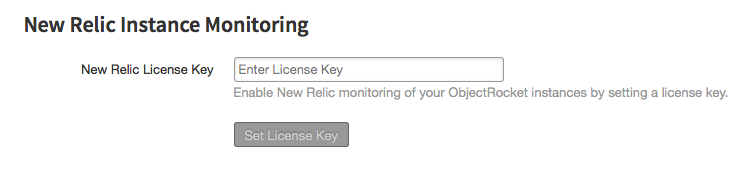
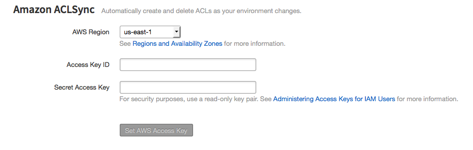
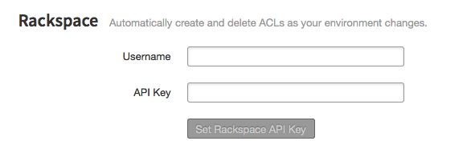

External Integrations
=====================

New Relic Metric Reporting
--------------------------

The ObjectRocket platform can automatically report metrics about your MongoDB instances to the New Relic monitoring service. If you don't have an account you can sign up through `New Relic <http://newrelic.com/signup>`_. You can then grab your License Key from your `Accounts page <https://rpm.newrelic.com/accounts>`_.

.. note::

   Please note that this is only for MongoDB instances. Please see below for Redis and Elasticsearch.

New Relic Monitoring for Redis and Elasticsearch
~~~~~~~~~~~~~~~~~~~~~~~~~~~~~~~~~~~~~~~~~~~~~~~~

We currently don't have official ObjectRocket plugins to monitor our Redis and Elasticsearch products, but we recommend using a third-party plugin called `MeetMe <http://newrelic.com/plugins/poison-pen-llc/28>`_. It's an Open Source plugin, and you can read more about the plugin and how to install it on their `GitHub page <https://github.com/MeetMe/newrelic-plugin-agent>`_.

Enabling New Relic Integration
^^^^^^^^^^^^^^^^^^^^^^^^^^^^^^

* To enable New Relic integration:
    * Go to the `External Integration Settings`_ page.
    * Enter a valid New Relic License Key and click **Set License Key**.

By default, metrics with automatically be reported for all instances, but you can disable it on a per instance basis in the **Settings** page. Each instance will appear as an individual dashboard in New Relic, and metrics are sent roughly every five minutes.

Disabling New Relic Integration
^^^^^^^^^^^^^^^^^^^^^^^^^^^^^^^

* To disable the reporting of metrics to New Relic for a particular instance:
    * Go to the settings page for that instance.
    * Uncheck the box labeled **New Relic Monitoring**.

.. image:: images/newrelic.png
    :align: center

* To disable New Relic integration completely:
    * Go to the `External Integration Settings`_ page.
    * Click the button labeled **Delete License Key**.

ACLSync
-------
The ObjectRocket platform can automatically retrieve IP addresses from your Rackspace Cloud or AWS environment, and create an ACL for each of those. This feature is currently limited to retrieving IP addresses from a single AWS region.

Enabling ACLSync
~~~~~~~~~~~~~~~~

By default, ACLs will automatically be created for all instances. For any service you can disable it on a per instance basis.

Amazon Web Services (AWS)
~~~~~~~~~~~~~~~~~~~~~~~~~

* Go to the `External Integration Settings`_ page.
* Add AWS credential information.
    * In the 'AWS' section, Select the AWS region from which to retrieve IP addresses.
    * Enter a valid Access Key ID.
    * Enter the Secret Access Key that corresponds to the Access Key ID.
    * Click the button labeled **Set AWS Access Key**.

Rackspace Cloud
~~~~~~~~~~~~~~~

* Go to the `External Integration Settings`_ page.
* Add Rackspace API credentials.
    * Add your Rackspace Cloud username.
    * Add your Rackspace Cloud API key.

Disabling ACLSync
^^^^^^^^^^^^^^^^^

Amazon Web Services (AWS)
~~~~~~~~~~~~~~~~~~~~~~~~~

* To disable automatic ACL creation for a particular instance:
    * Go to the settings page for that instance.
    * Uncheck the box labeled **Amazon ACL Sync**.

.. image:: images/awssync.png
    :align: center

* To disable automatic ACL creation completely:
    * Go to the `External Integration Settings`_ page.
    * In the *Amazon* section, click the button labeled **Delete AWS Access Key**.

Rackspace Cloud
~~~~~~~~~~~~~~~

* To disable automatic ACL creation for a particular instance:
    * Go to the settings page for that instance.
    * Uncheck the box labeled **Rackspace ACL Sync**.

.. image:: images/raxsync.png
    :align: center

* To disable automatic ACL creation completely:
    * Go to the `External Integration Settings`_ page.
    * In the *Rackspace* section, click the button labeled **Delete Rackspace API Key**.

If you have any trouble or questions you can always reach out to our `support team <mailto:support@objectrocket.com>`_!

.. _External Integration Settings: https://app.objectrocket.com/external/new_relic
.. _accounts: https://rpm.newrelic.com/accounts
.. _New Relic login: https://rpm.newrelic.com/login
