MongoDB Instance Settings
=========================

This is where you can modify settings specific to an instance.

General
=======

RocketScale Threshold
---------------------

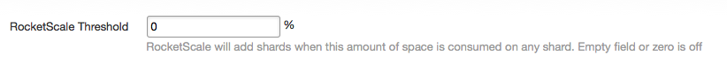

RocketScale is our auto-scaling feature with which you can specify a percentage of space currently used and when that limit is hit, an additional shard will be added to scale the instance horizontally. This will only add shards in the current plan size, eg. 5GB instance will have additional 5GB shards added. One caveat here is that if you don't have a `shard key <http://docs.mongodb.org/manual/core/sharding-shard-key/>`_ defined, but have this enabled, a shard will still be added to the instance but not be able to use the additional space for any unsharded collections.

Profiling Level
---------------

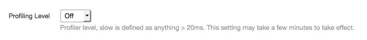

This allows you to enable a specific `profiling level <http://docs.mongodb.org/manual/tutorial/manage-the-database-profiler/>`_ for databases on this instance. Slow, by default, is anything longer than 100ms, and All will log all queries. All does incur a performance hit as it turns every query into a write, regardless of the query itself.

Auto Key Checkbox
-----------------

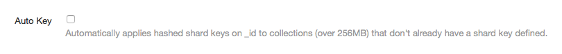

Auto Key is our feature which will automatically apply a hashed index on collections larger than 256MB that do not already have a shard key defined. It will notify you via email of any created, after it's applied the index and hashed key. It operates per database, so an ideal use case would be to specify shard keys on your larger collections where performance is needed most, and then let our system handle the rest for smaller collections.

Balancer
========

These settings revolve around the MongoDB `balancer <http://docs.mongodb.org/manual/core/sharding-balancing/>`_. Summarizing, the balancer handles data distribution among the shards within in a sharded instance.

Balancer Checkbox
-----------------

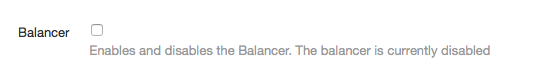

This enables or disables the balancer entirely. Please use with caution, as if a shard is added and this is turned off, no data will be allocated to the new shard.

Balancer Window (UTC)
---------------------

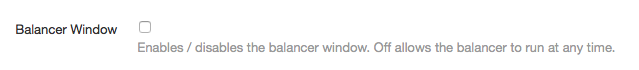

This allows you to choose whether the balancer is allowed to run all the time, or within a definable daily window. Please note this is in Coordinated Universal Time, or UDT.

Balancer Schedule
-----------------

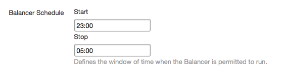

This allows you to specify when the balancer runs each day, making sure no data is in transit during peak hours. MongoDB has this set in UTC to help minimize any timezone differences, so please be aware when choosing when this is run.

Stepdown Window
===============

ObjectRocket can handle compactions for you automatically, making sure you're only using the least possible space. MongoDB automatically creates file extents to add data to later, which can sometimes make the database seem like it's using more space than it really is. Setting a stepdown window allows us to compact your instance weekly ensuring that the padding factor doesn't grow unchecked. It also allows you to reclaim disk space from deleted documents which MongoDB doesn't give back to the OS natively. You can read more on Mongo's space allocation here: `Why are the files in my data directory larger than the data in my database? <http://docs.mongodb.org/manual/faq/storage/#why-are-the-files-in-my-data-directory-larger-than-the-data-in-my-database>`_

Stepdown Scheduled
------------------

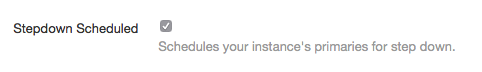

This enables or disables the stepdown option for this instance.

Stepdown Window (PDT)
---------------------

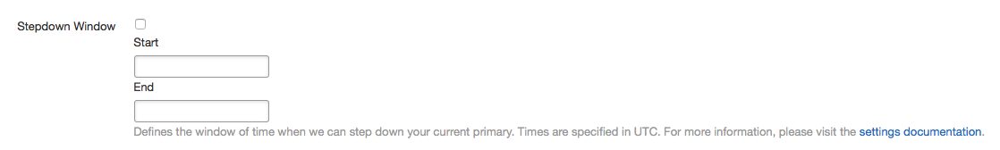

This is the window in which your instance is allowed to stepdown. It needs to be at least a 10 minute window to allow for oplog differences between members, as it will not stepdown if a secondary isn't within a small enough difference from the current primary. Please note this time is in Pacific Daylight Time.

Enable Weekly Stepdown
----------------------

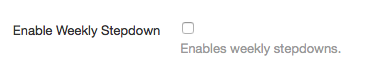

This lets our system know if the stepdown can occur weekly to help automate compactions.

Enable Weekly Compaction
------------------------

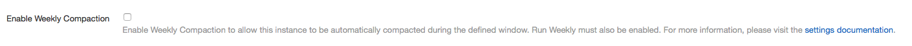

This enables our system to compact the instance on a weekly basis. The above stepdown setting must be enabled to have this continue from week to week. If 'Weekly Stepdown' is not enabled, the compaction will only run once.

External Integration
====================

These are features that extend our platform to interact with others, giving you more insight into what your instance is doing!

New Relic Monitoring
--------------------

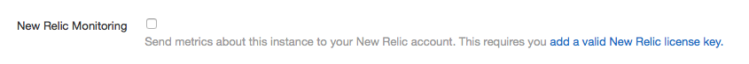

This enables or disables the NewRelic intergration, sending statistics around this OR instance to your NewRelic dashboard. It requires you have entered a valid NewRelic license key.

Amazon ACL Sync
---------------

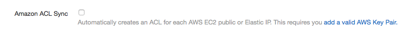

This enables or disables our AWS Sync feature, which will automatically add any IP addresses for your AWS nodes and add them as ACL's for your OR instance.

Rackspace ACL Sync
------------------

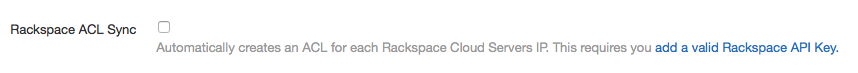

This enables or disables our Rackspace Sync feature, which will automatically add any IP addresses from your Cloud Servers and add them as ACL's for your OR instance.

Monitoring
==========

This is a very basic feature which allows you to receive an email letting you know your instance is above a particular storage percentage.

Instance Storage Usage
----------------------

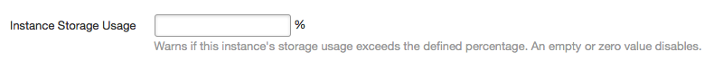

Here is where you'll set the percentage you'd like to receive notifcations around. Any number between 1 and 100 is valid. An empty or 0 value disables the notification.