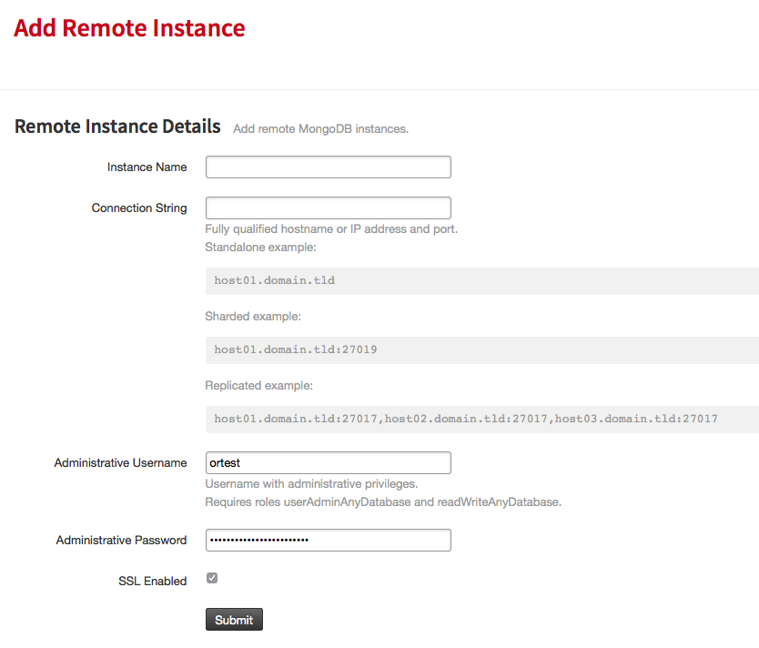

Features
========

AutoKey
-------

Auto Key is our feature which will automatically apply a hashed index on `_id` for collections larger than 256MB that do not already have a shard key defined. Auto Key operates per database, so an ideal use case would be to specify shard keys on your larger collections where performance is needed most, and then let our system handle the rest for smaller collections. Our system will also send you a notification by email for any shard keys created and applied to collections.

RocketScale
-----------

RocketScale is our solution to auto-scaling with which you can specify a percentage of space currently used and when that limit is hit, an additional shard will be added to scale the instance horizontally. This will only add shards in the current plan size, eg. 5GB instance will have additional 5GB shards added. 

.. note::

 One caveat here is that if you don't have a `shard key <http://docs.mongodb.org/manual/core/sharding-shard-key/>`_ defined, but have this enabled, a shard will still be added to the instance but not be able to use the additional space for any unsharded collections. It is recommended that you use this in conjunction with **AutoKey** to avoid this problem.

Automated Compactions
---------------------

ObjectRocket can handle compactions for you automatically, making sure you're only using the least possible space. MongoDB automatically creates file extents to add data to later, which can sometimes make the database seem like it's using more space than it really is. Setting a stepdown window allows us to compact your instance weekly ensuring that the padding factor doesn't grow unchecked. It also allows you to reclaim disk space from deleted documents which MongoDB doesn't give back to the OS natively. You can read more on Mongo's space allocation here: `Understanding MongoDB Space Usage <http://objectrocket.com/blog/how-to/understanding-mongodb-space-usage>`_ and here: `Why are the files in my data directory larger than the data in my database? <http://docs.mongodb.org/manual/faq/storage/#why-are-the-files-in-my-data-directory-larger-than-the-data-in-my-database>`_

Daily Backups
-------------

Backups are taken once daily by default, but please talk to our `sales team <mailto:sales@objectrocket.com>`_ if you need a different schedule. Backups are taken per instance, and they're absolutely free when using our default retention period.

Remote Instance
---------------

We offer viewing MongoDB instances outside of our infrastructure in our Control Panel, and this lets you have another view into what's going on with your database.

Remote Instance Backups
-----------------------

We also offer free backups for remote instances as well, all you need to do is add them to our Control Panel!

Delayed Slaves
--------------

Everyone makes mistakes, we know this, and offer a solution just for those fat-fingered moments. MongoDB allows having delayed slaves and as such so do we! You can configure a slave to run an hour or more behind the rest of the cluster, letting you easily roll back if you notice a mistake. This feature has an additional cost, but does also provide direct access to this delayed slave via a virtual IP address for tools/scripts to have access specifically to the delayed slave. If you'd like to add a delayed slave to an instance, please email our `sales team <mailto:sales@objectrocket.com>`_!

AWS DirectConnect
-----------------

We offer AWS DirectConnect in our UK-London, US-East-IAD3, and US-West datacenters, as long as you're using a Sharded instance.

ServiceNet Access
-----------------

We offer ServiceNet connectivity within Rackspace datacenters, which correspond to US-Chicago, US-East-IAD3, US-Dallas, UK-London, Sydney, and Hong Kong.

ACLSync
-------

The ObjectRocket platform can automatically retrieve IP addresses from your Rackspace Cloud or AWS environment, and create an ACL for each of those. This feature is currently limited to retrieving IP addresses from a single AWS region.

New Relic
---------

The ObjectRocket platform can automatically report metrics about your MongoDB instances to the New Relic monitoring service. If you don't have an account you can sign up through `New Relic <http://newrelic.com/signup>`_.
