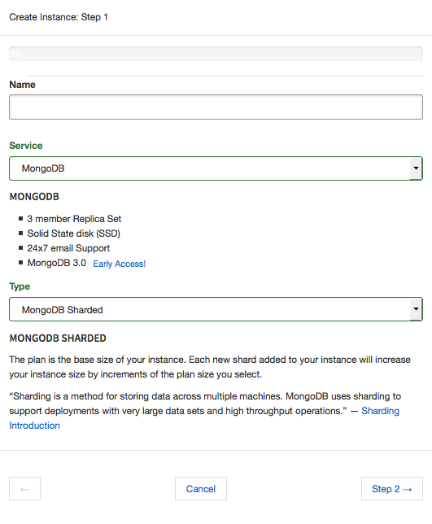
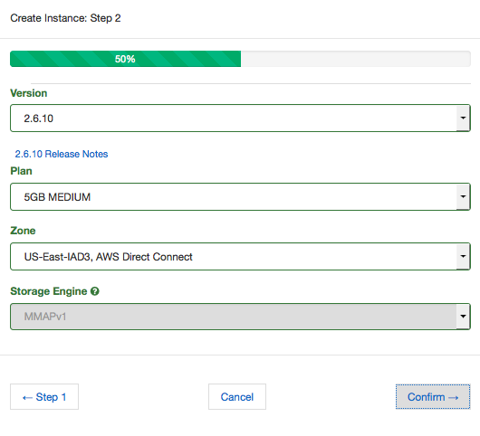
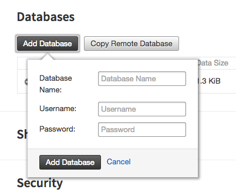
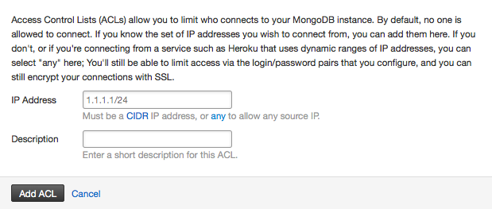

Getting Started with MongoDB
============================

1. Create an instance
~~~~~~~~~~~~~~~~~~~~~

.. note::

   If you need help deciding what kind of instance to create, take a look at our :doc:`mongodb_overview`!

Step 1
------

#. Click the Instance heading, then click on *Add Instance*.

#. Enter a name for your instance. 

    This can be almost anything, as any alpha numeric string is valid.

#. Select MongoDB for the service.

#. Select a database type.

    Choose either MongoDB Sharded or MongoDB Replica Set. Each selection includes a brief description, and more information can be found on our `MongoDB Overview <http://objectrocket.com/docs/mongodb_overview.html>`_.

Click on *Step 2* to continue.

Step 2
------

#. Select a version to deploy. 

    We offer the latest versions of MongoDB 2.4, 2.6, and 3.0. If you select 3.0, you can also select a storage engine (see below).

#. Select a plan that suits your needs. 

    Sharded instances grow by adding shards according to your plan size. The size of a replica set is fixed, determined by your plan's size limit. For more details, check out `plans and pricing <http://objectrocket.com/pricing>`_.

#. Select a zone that suits your needs. 

    Zones are Rackspace and/or AWS Direct Connect zones, labeled by airport codes in that region. Check out the `zone map <http://objectrocket.com/features>`_ for more details.

#. Select a plan that suits your needs. 

    Consider that as you grow you always add shards in your plan size when using a Sharded instance, but that isn't possible for a Replica Set. For more details, check out `plans and pricing <http://objectrocket.com/pricing>`_.

#. Select a storage engine (3.0 only).

    You can select WiredTiger or MMAPv1 for your storage engine when deploying MongoDB 3.0.

#. Select encryption.

    You can choose to encrypt MongoDB 2.6 or 3.0 instances provisioned in Virginia (IAD). Encryption for 3.0 requires WiredTiger for the storage engine and a plan minimum of 20GB.

Click on *Confirm* to review your entries, then click *Create*. Your new instance is ready!

2. Add a database
~~~~~~~~~~~~~~~~~~~~

#. Click the instance name to view its details and available operations. 

    Instances you create appear under the *Instances* heading. 

#. Select the desired instance and scroll down to *Databases*.

#. Click on *Add Database*. 

    Enter a name, username, and password, then click *Add Database* to confirm.

    Click on a database name to add collections or more users. You can also add collections and users with the ObjectRocket API or MongoDB shell.

3. Add an Access Control List (ACL)
~~~~~~~~~~~~~~~~~~~~~~~~~~~~~~~~~~~

Access Control Lists (ACL) limit who connects to your instance. 

.. note::

  ObjectRocket denies access by default. Add an ACL for any server that connects to the instance.

#. In the Security section of the instance details page, click *Add ACL*. 

#. Enter an IP address/CIDR block and a description.

    Only the IP address is mandatory, but descriptions can help when maintaining larger lists.

#. Click *Add ACL Entry*.

4. Connect!
~~~~~~~~~~~

After you've created a database with user authentication and added an ACL, you're ready to test basic connectivity in a terminal session with the MongoDB shell::

  $ mongo iad-mongos0.objectrocket.com:<PORT>/<DATABASE> -u <USER> -p <PASSWORD>
  MongoDB shell version: 2.4.6
  connecting to: iad-mongos0.objectrocket.com:<PORT>/<DATABASE>

  mongos> show collections
  example_collection
  system.indexes
  system.users

  mongos>

If you see something similar after running `show collections`, you're connected to the instance and can perform database operations. Success!

Support
~~~~~~~

If you have any issues or just need guidance, contact our `support team <mailto:support@objectrocket.com>`_.
