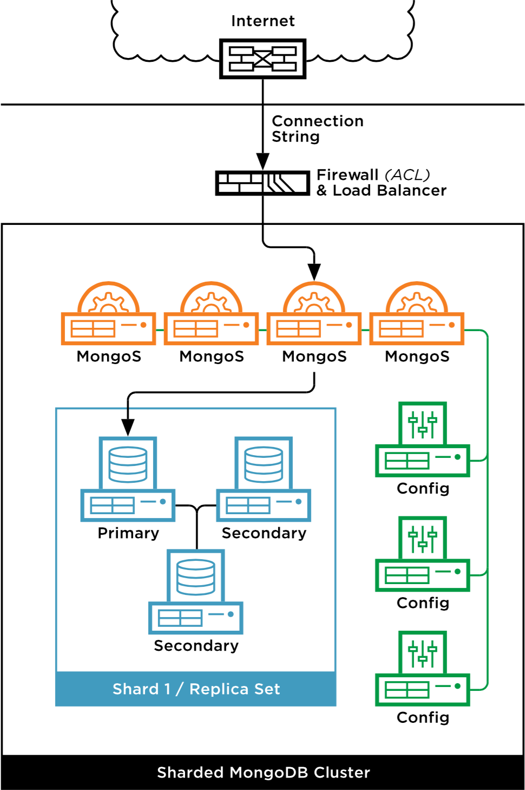
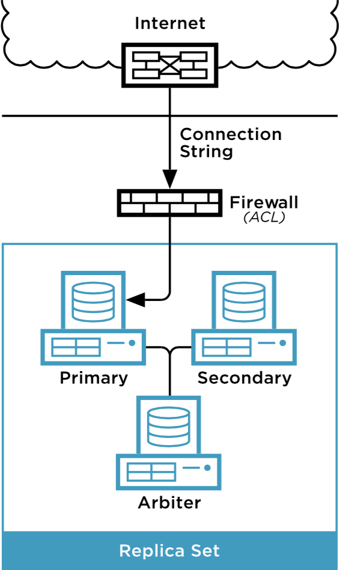

MongoDB Overview
================

ObjectRocket offers different products now, but our original was MongoDB as a Service. Our MongoDB infrastructure has been specifically designed to be scalable, performant, highly available, and most of all easy to use!

We offer easy provisioning through our `Control Panel <https://app.objectrocket.com>`_ and once created can be accessed through any of the standard MongoDB connection methods. We define an instance on our platform as a highly available cluster, which can have multiple databases underneath. You'd manage each instance as a whole, with it's own connect string and ACL's, as well as individual databases and collections inside.

What types of MongoDB do we offer?
----------------------------------

We currently offer two different types of MongoDB, a sharded version, and a simpler replica set, each in different sizes. Let's go over each to see what might fit your usage better.

Sharded instances
~~~~~~~~~~~~~~~~~

Sharded MongoDB instances are offered in 5GB, 20GB, 50GB, 100GB, and even larger sizes, which if you need, can talk to our `Sales team <mailto:sales@objectrocket.com>`_ to discuss!

In our sharded plans, an instance when created will start with:

- 4 mongos servers
- 3 config servers 
- 1 shard

A shard is comprised of a three member replica set (1 Primary + 2 Secondaries). This is for data redundancy, fault tolerance, and provides us with the ability to do maintenances in a MongoDB best practice way. 

These plans also come with Rackspace ServiceNet connectivity within the same datacenter, SSL connectivity, and AWS DirectConnect in our UK-London, US-East-IAD3, and US-West datacenters.

Here's what the underlying infrastructure looks like:

Replica sets
~~~~~~~~~~~~

Our Replica set instances are available in 1GB (scalable to 5GB, limited to 2.4.6 with a single database), 5GB, 20GB, 50GB, and 100GB sizes. These don't have the ability to scale as the Sharded instances do, so are meant more for development or simpler use cases where sharding may not be needed. The 5GB+ replica sets default to 2.4.10, but other versions can be made available to reaching out to our `Support team <mailto:support@objectrocket.com>`_.

.. note::

   Replica set instances do not offer SSL or ServiceNet connectivity, so please keep that in mind. We recommend using Sharded plans for that access, as they have the additional infrastructure needed to support those features. Replica sets **do** offer AWS DirectConnect in our UK-London, US-East-IAD3, and US-West datacenters.

As always, if you have any questions about anything you've read here, please feel free to reach out to our `Support team <mailto:support@objectrocket.com>`_!