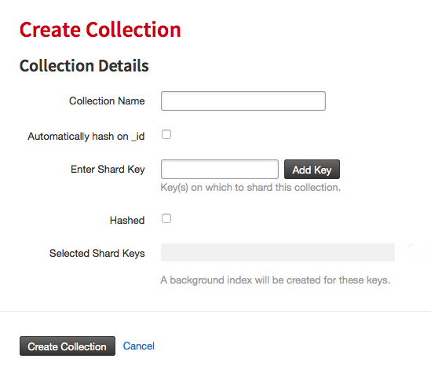
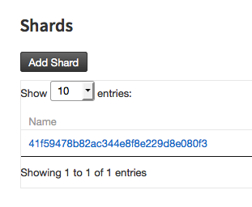

Sharding and Scaling Guide
==========================

ObjectRocket sharded instances implement standard MongoDB sharding, but hides the complexity of all the components into an easy to use service. The standard components are all automatically provisioned by our systems on demand. The MongoDB balancer is used to keep data between shards at an even level. For more information about the MongoDB sharding architecture check out MongoDB's official :mongo-manual:`sharding introduction </core/sharding-introduction>`.

Shard keys
----------

Keys must be defined for how data will be split among the shards. There are two ways to achieve this on our platform:

1. Manual shard key definition
~~~~~~~~~~~~~~~~~~~~~~~~~~~~~~

Choosing the proper shard key is critical to performance and scalability. MongoDB Inc. has written a :mongo-manual:`great primer </tutorial/choose-a-shard-key>`, but our `DBA's <mailto:support@objectrocket.com>`_ would be happy to help as well!

Defining shard keys manually is performed via the ObjectRocket control panel.  This is done for existing collections on an individual basis by navigating to the instance, database, then collection and selecting the *shard key* tab.  Click the **add shard key** button to define the key.

.. image:: images/addshardkey.png
	:align: center

When new collections are made you have the option to define a shard key during that process as well.

2. Automated shard key definition with AutoKey
~~~~~~~~~~~~~~~~~~~~~~~~~~~~~~~~~~~~~~~~~~~~~~

Our platform can help automate the creation of shard keys on MongoDB 2.4 and up using a feature named AutoKey. Autokey watches each and every MongoDB instance, and when the criteria is met for adding keys, the agent creates and applies the shard key.

This setting gives true 'set and forget' sharding capabilities. The potential downside is a hashed shard key on _id may not be optimal in every case.

In order to enable AutoKey:

- **AutoKey** in the settings must be set to **ON**.

AutoKey will then check all collections periodically and add shard keys if following are true:

- The collection has more than 256MB of data.
- The collection doesn't already have a shard key.

Scaling
-------

Scaling on our platform is easy. When a MongoDB instance scales a shard is added, then the balancer moves some of the existing data to this new shard giving more compute and storage to the cluster.

Shards can seamlessly be added to an instance at any time. To add a shard click the **Add Shard** button on the **Instance Details** page.  This will add a shard in the plan size of the instance. If you don't want to manage adding shards manually, you can enable RocketScale, described below.

RocketScale
-----------

RocketScale is an agent unique to ObjectRocket that scales sharded instances in an automated fashion as the instance grows. RocketScale watches each MongoDB instance, and when RocketScale threshold on the settings page is exceeded it adds a shard to the instance.

The RocketScale threshold is based on total percentage of storage consumed on the cluster. The current storage usage is viewable on **Instance Details** by clicking the instance name on the `Instances`_ page. For example, if the plan is 20GB, and there are currently 2 shards for a total available storage space of 40GB, and Rocketscale is set to 75%, then when the storage usage reaches 30GB a shard will be added.

.. _Instances: https://app.objectrocket.com/instances

RocketScale may be turned off by setting it to zero or removing any value from the field on the settings page.

Balancer
--------

ObjectRocket utilizes the MongoDB Inc balancer.  The balancer by default is in the ON state.  If the balancer is impacting performance it can be turned OFF or alternatively,  daily windows can be defined for when the balancer may run.  Defining balancer windows is done in the control panel under the settings section on the **Instance Details** page.  In general it's not recommended to turn the balancer off, as this can effect the ability of the system to scale properly when you have more than one shard.

The **Instance Details** page in the control panel shows the current balance of the cluster by percentage of total.

The balancer status is also viewable on the instance settings page, and is either *Stopped* or *Running*.
