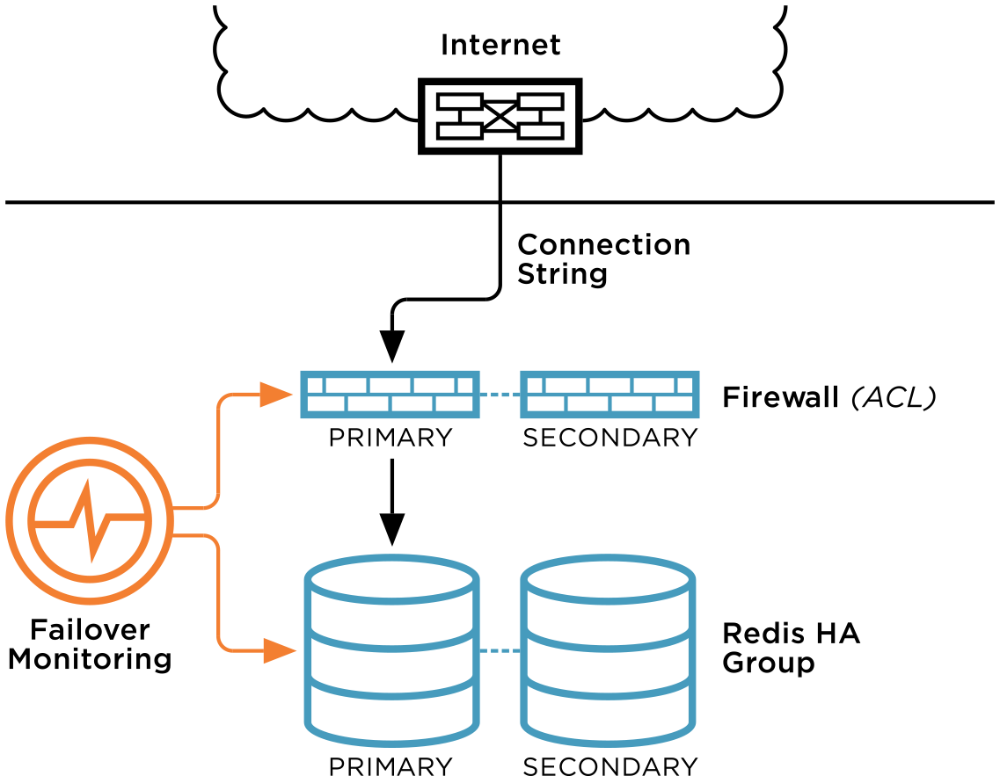

ObjectRocket Redis FAQ
======================

What is ObjectRocket Redis?
~~~~~~~~~~~~~~~~~~~~~~~~~~~

ObjectRocket Redis simplifies application development by offering pre-configured, high performance, highly available Redis instances built on the same hardware stack that makes our MongoDB offering successful. Simple provisioning and administration, along with the ability to scale on demand makes it easy for developers to integrate our Redis platform into an application stack.

Is ObjectRocket Redis highly available?
~~~~~~~~~~~~~~~~~~~~~~~~~~~~~~~~~~~~~~~

Yes it is! Our Redis instances feature seamless automatic failover of the Redis master to a slave in the event of a master node failure.

What plans and sizes do you offer?
~~~~~~~~~~~~~~~~~~~~~~~~~~~~~~~~~~

All plans reflect useable memory:

* 500MB
* 1GB
* 2.5GB
* 5GB
* 10GB
* 20GB
* 50GB

If you require something larger, please contact our `sales team <mailto:sales@objectrocket.com>`_ and we'll be happy to discuss!

Can I use a single Redis instance for multiple purposes?
~~~~~~~~~~~~~~~~~~~~~~~~~~~~~~~~~~~~~~~~~~~~~~~~~~~~~~~~

Yes, of course! As long as the app doesn't use the same keys in different areas, you'll be fine. The major point here is to avoid data collision by trying to use the same key for different purposes.

What kind of support should I expect?
~~~~~~~~~~~~~~~~~~~~~~~~~~~~~~~~~~~~~

ObjectRocket for Redis is backed by Fanatical Support 24/7/365 to monitor and fix issues with customer instances or infrastructure, assist with data migrations, fine-tune Redis configurations, as well as any other issues you may have while using it. Our engineers also provide architecture advice and data structure best practices if you need help figuring out how to best leverage Redis in your app.

Will you help migrate my data?
~~~~~~~~~~~~~~~~~~~~~~~~~~~~~~

We currently offer migration assistance to customers moving to a 20GB or larger instance, but please don't hesitate to reach out to our `support team <mailto:support@objectrocket.com>`_!

What software is being used?
~~~~~~~~~~~~~~~~~~~~~~~~~~~~

The offering is based on Redis 2.8.13 with Sentinel for high availability. All instances are Highly Available, and all instances persist to disk.

What does the system architecture look like?
~~~~~~~~~~~~~~~~~~~~~~~~~~~~~~~~~~~~~~~~~~~~

Like this!

* Our Redis environment utilizes 2 node clusters and 3 Sentinels. One Redis node is master, one node is a slave.
* All services are containerized, which provides guaranteed resources (memory, CPU, disk I/O), prevents “noisy-neighbor” problems, and eliminates the performance bottlenecks of traditional hardware virtualization.
* The service runs on performance-optimized infrastructure to make Redis run as fast as possible.
* AWS users will automatically use dedicated 10Gbit AWS Direct Connect circuits for very high throughput, low latency connectivity to ObjectRocket for Redis.

What version of Redis is supported?
~~~~~~~~~~~~~~~~~~~~~~~~~~~~~~~~~~~

As of 07/10/2015 ObjectRocket supports Redis 2.8.17.  Contact our `support team <mailto:support@objectrocket.com>`_ for help with other versions.

Do you support Redis Cluster?
~~~~~~~~~~~~~~~~~~~~~~~~~~~~~

No, we don't feel it’s stable enough for production today, but we do have it on our roadmap!

How much does ObjectRocket for Redis cost per month?
~~~~~~~~~~~~~~~~~~~~~~~~~~~~~~~~~~~~~~~~~~~~~~~~~~~~

Please see our `pricing page <http://objectrocket.com/pricing#redis>`_ for details.

How does billing work?
~~~~~~~~~~~~~~~~~~~~~~

Please refer to our `Billing FAQ <http://docs.objectrocket.com/billing.html>`_.

How do I connect to my Redis instance?
~~~~~~~~~~~~~~~~~~~~~~~~~~~~~~~~~~~~~~

Start the redis-cli with the hostname, port, and password:

.. code-block:: bash

    redis-cli -h my-host -p 1234 -a mypassword

If you have any other questions please don't hesitate to reach out to our `support team <mailto:support@objectrocket.com>`_!
