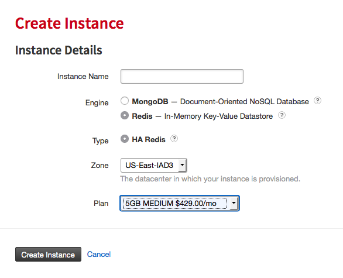
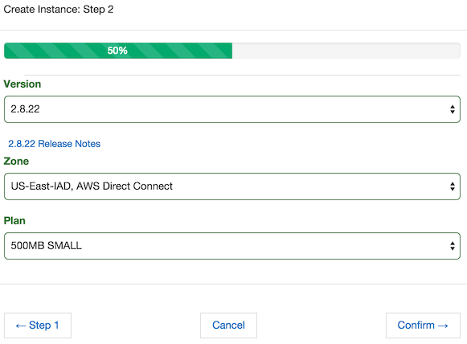

Getting Started with Redis
==========================

1. Create an instance
~~~~~~~~~~~~~~~~~~~~~

Step 1
------

#. Click the Instance heading, then click on *Add Instance*.

#. Enter a name for your instance. 

    This can be almost anything, as any alpha numeric string is valid.

#. Select Redis for the service and the type defaults to HA Redis.

Click on *Step 2* to continue.

Step 2
------

#. Select a version to deploy.

    ObjectRocket offers versions 2.8 and 3.0.

#. Select a zone.

    Zones are Rackspace and/or AWS Direct Connect zones, labeled by airport codes in that region. Check out the `zone map <http://objectrocket.com/features>`_ for more details.

#. Select a plan that suits your needs. 

    For more details, check out `plans and pricing <http://objectrocket.com/pricing>`_.

Click on *Confirm* to review your entries, then click *Create*. Your new instance is ready!

2. Add an Access Control List (ACL)
~~~~~~~~~~~~~~~~~~~~~~~~~~~~~~~~~~~

Access Control Lists (ACL) limit who connects to your instance.

.. note::

        ObjectRocket denies access by default so you need to add any appropriate ACL's for servers that are connecting to ObjectRocket.

#. In the Security section of the instance details page, click *Add ACL*. 

#. Enter an IP address/CIDR block and a description.

    Only the IP address is mandatory, but descriptions can help when maintaining larger lists.

#. Click *Add ACL Entry*.

.. image:: images/addacl_mongo.png
   :align: center

3. Connect!
~~~~~~~~~~~

After you've created a database with user authentication and added an ACL, you're ready to test basic connectivity in a terminal session with redis-cli::

   $ redis-cli -h '<hostname>' -p '<port>' -a '<password>'
   hostname:port> set my_key my_value
   OK
   hostname:port> get my_key
   "my_value"

You can also connect with netcat/telnet::

   $ nc '<hostname>' '<port>'
   auth <password>
   +OK
   set my_key my_value
   +OK
   get my_key
   $8
   my_value

If you see similar results, you're connected to the instance and can perform database operations. Success!

If you encounter any issues or just want some guidance, please reach out to our `support team <mailto:support@objectrocket.com>`_!
